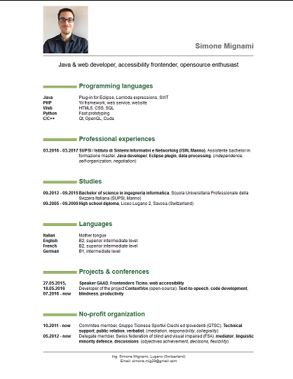

Curriculum Vitae with Markdown
===============================

This is an example on how create a CV using Markdown.
The output file will be an HTML page "all inclusive". It can also be converted into PDF.

This is the final result:

File list
----------

Below are listed all files involved:

cv.md
:	the main document, it contains all information about you.

cv.html
:	the final result, is the document that you can publish

footer.html
:	it may contains your contact information.

style.css
:	contains the style of the document. You should not modify this file.

Document structure
-------------------

To edit this document you should have a basic knowledge of Markdown's syntax. I suggest you to read The [Pandoc’s Markdown guide](http://pandoc.org/MANUAL.html).

The first line of the ".md" file is your picture, that has to be placed on the "/pictures" folder.
The block quote at the beginning should contain some keyword that describe your skills.

Each level 2 heading contains a section of your curriculum, such as skils, professional experiences, languages, etc.

Produce the CV
---------------

To produce the final document you have to convert the Markdown file into HTML. To do it I suggest to use [Pandoc](http://pandoc.org/), a command line program that converts in many markup languages.
Install it then type:

~~~
pandoc -s -S -H style.css -A footer.html cv.md -o cv.html
~~~

----

> **Note**: the *.css* contains the HTML tag  because it is embedded on the document.

Conclusions
-------------

Produce a Curriculum Vitae using Markdown is simpler than using other traditional methods such as Word or LaTeX.

**Tips**

- Avoid writing CV longer than 1 page, otherwise nobody will read it!
- Use keywords instead of sentences, you are not writing your biography.
- Insert just the most important thing about you.

Email me if you need further explanations.
Good luck for your job application! ;-)
