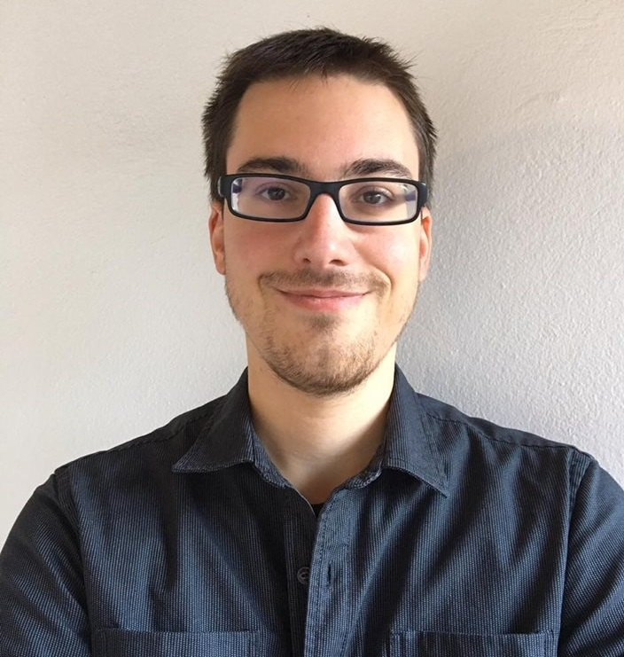

Simone Mignami
==============

----

> Java & web developer, accessibility frontender, opensource enthusiast

Programming languages
----------------------

Java
:	Plug-in for Eclipse, Lambda expressions, SWT

PHP
:	Yii framework, web service, website

Web
:	HTML5, CSS, SQL

Python
:	Fast prototyping

C/C++
:	Qt, OpenGL, Cuda

Professional experiences
-------------------------

03.2016 - 03.2017
:	**SUPSI / Istituto di Sistemi Informativi e Networking (ISIN, Manno)**. Assistente bachelor in formazione master.
**Java developer**, **Eclipse plugin**, **data processing**.
(*independence*, *self-organization*, *negotiation*)

Studies
--------

09.2012 - 09.2015
:   **Bachelor of science in ingegneria informatica**, Scuola Universitaria Professionale della Svizzera Italiana (SUPSI, Manno)

09.2005 - 09.2009
:	**High school diploma**, Liceo Lugano 2, Savosa (Switzerland)

Languages
----------

Italian
:	Mother tongue

English
:	B2, superior intermediate level

French
:	B2, superior intermediate level

German
:	B1, intermediate level

Projects & conferences
-----------------------

27.05.2015, 18.05.2016
:	**Speaker GAAD**, **Frontenders Ticino**, **web accessibility**

07.2016 - now
:	Developer of the project **ContextVox** (open-source). **Text-to-speech**, **code development**, **blindness**, **productivity**

No-profit organization
-----------------------

10.2011 - now
:	Commitee member, Gruppo Ticinese Sportivi Ciechi ed Ipovedenti (GTSC).
**Technical support**, **public relation**, **verbalist**.
(*mediation*, *responsibility*, *collegiality*)

05.2012 - now
:	Delegate member, Swiss federation of blind and visual impaired (FSA).
**mediator**, **linguistic minority defence**, **discussions**.
(*objectives achievement*, *decisions*, *flexibility*)

